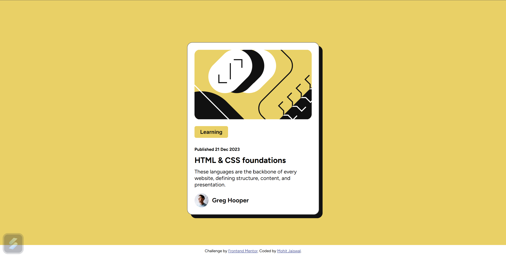

# Frontend Mentor - Blog preview card

This is a solution to the QR code component challenge on [Frontend Mentor](https://www.frontendmentor.io). Frontend Mentor challenges help you improve your coding skills by building realistic projects.

## Table of Contents

- [Overview](#overview)
- [Screenshot](#screenshot)
- [Links](#links)
- [My Process](#my-process)
- [Built With](#built-with)
- [Continued Development](#continued-development)
- [Author](#author)

## Overview

A simple QR code component built using HTML and CSS, following the design guidelines provided by Frontend Mentor.

## Screenshot

 _(Add your screenshot here)_

## Links

- **Repo Link:** [mohit421](https://github.com/mohit421/Personal_Project/tree/main/Learning/FUllStackWebDevByHUXN/FrontendMentor/02.BlogPreviewCard)
- **Live Link:** [BlogPreviewCard]()

## My Process

## Built With

- Semantic HTML5 markup
- CSS Custom, Flexbox and Absolute property

## Continued Development

- I have used Flexbox property to center card.I have used recommended color, font and bg-color

## Author

- **GitHub:** [mohit421](https://github.com/mohit421)
- **Frontend Mentor:** [@mohit421](https://www.frontendmentor.io/profile/mohit421)
