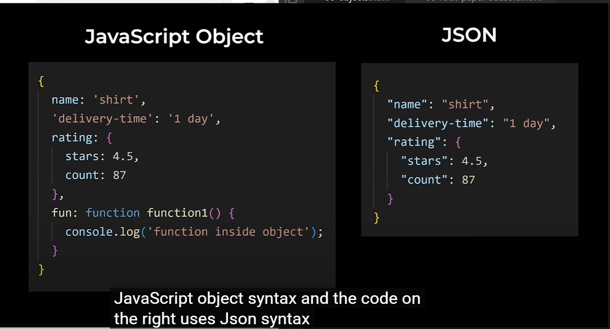

<!-- supersimple.dev/projects/amazon/checkout -->

<!-- Number and Math -->

- Computer have a problem working with floats.
- Calculations with floats are sometimes inacurate.
- When working with money
- It's best practce to do the calc in cents
- and convert back to dollar from cents

```
20.95+7.99 - give an inaccurate result
to avoid this we can calculate like
(2095+799)/100
```

# What I have learn yet

```
In this lession:
1. Numbers and Math
2. Order of Operations, and Brackets(...)
3. Claculated the number in final project
4. Calculations using floats can be inaccurate
```

```
- How to convert 2.8 to 2
- Math.floor(2.8); // return 2
- Math.ceil(2.8) → rounds up to 3
- Math.round(2.8) → rounds to the nearest integer (3 in this case)
- Math.trunc(2.8) → removes the decimal part, returns 2
```

# Strings

- Checkout String.js for more details

# HTMl and CSS Review , Console.log

- We have added script tag at the bottom of body tag bcuz we want that web page will be created first then we will use JS to make it interactive

- If you want to learn HTMl and CSS then goto the Folder FullstackWebDevByHUXN -> HTML&CSSLearning
- If you want to make project then go to FrontendMentor and HTML&CSSProjects inside FULLStackWebDevbyHuXn

#### Comments

```
- This are the piece of code that JS will going to ignore it
- // :- This is a comment
- /*
  Multi-
  line
  Comment
  */
- Why we use Comments:-
  - Provide more information
  - If we don't want to run some piece of code for debuggin purpose.
```

# Variables

---

```
- What is a Variables ?
    - variable = a container
    - We can save a value like a number of strings inside a variable and then use it later
- Go to 05-Variables-> variables.htm file for more info
- we can save any type of value in a variables including strings

#### Variables name Restrictions:
  1. Can't use special words
    Example: let
  2. Can't start with a number
  3. Can't use special characters except: $ and _

- ; = end of an instruction ( Similar to a. in english)
- we need semi-colon(;) to separate instructions in Javascript
- we can't assing same variable name to let


```

- Goto Projects for exercises :- [Supuer Simple Dev](supersimple.dev/projects/variables)

### Variable re-assignment Shortcuts

- +=2 --> variable = variable + 2
- -=2 --> variable = variable - 2
- _=2 --> variable = variable _ 2
- /=2 --> variable = variable / 2
- ++ --> variable = variable + 1
- -- --> variable = variable - 1

### Naming Conventions

1. camelCase :- In this we combine the words together and capitalize every word except the first word (Standard naming convention in JS)
   eg: camelCase :- cartQuantity
2. PascalCase :- CartQuantity
3. kebab-case : cart-quantity

   - It doesn't work in JS , dash (-) is always a minus symbol
     however we use kebab-case in HTML and CSS and also in our file_name

4. snake_case : cart_quantity
   - It really used in other language but it's not really used in JS

### Ways to create a variables in JS

- There are three ways to create variables in Javascript
  1. let
  2. var
  3. const
  - We can't changes it's value, using const we are sure that it's value remain constant
  - Assignment to const variable is not valid
  - Best practice = use cosnt by default (only use let when we need to change the variable)

#### typeof

- It tells us the what type a value is

---

# Booleans and if-statement

- Booleans are another type of value

  - There are only 2 booleans values;
    true and false
  - It represents whether something is true of false

- Comparision Operators

  - > greater than
  - < less than
  - > = greater than or equal to
  - <= less than or equal to
  - === equal to
  - !== not equal to

- IN JS there are two ways to check whether two value are equal :
  - == : It tries to convert both values into the same type
    ```
    - console.log(5 == '5.00'); // true
    bcz double equals convert both values into the same type , so convert both into number 5 and then compares them so that's why they are equal.
    ```
  - === : That's why in JS we always use triple equals (===) to check if two values are same so that we avoid the conversion behavior of double equals
  ```
  for ex: console.log(5 === '5.00') // false
  - comparison operator have lower priority that math
  ```

```
- In the order of Opeartions:
1. (...)
2. * /
3. + -
4. Comparison operators
```

# If- Statements

- Lets us write multiple groups of code
- and then decide which code to run

- Create a rock paper and scissors projects

```
<!--

- We can pick a move and then the computer will pick a random move and it will show us the result and we also have the score of how many times we won, lost and tied

- Rules of Rock(✊) Paper('✋') Scissors(✌️)

   - rock beats scissors
   - paper beats rock
   - scissor bears paper
-->

<!-- Steps:
     when we click a button:
     1. Computer randoomly seleccts a move
     2. Compare the moves to get the result
     3. Display the result in a popup
     Math.randoom : generates a number greater than equal to zero and less then one. 0 <=number <1
     -->
Random number between :-
if between 0 and 1/3 => rock
if between 1/3 and 2/3 => paper
if between 2/3 and 1 => scissors


```

# Logical Operator

- And Operator && : It left and right side both true then it will return true otherwise false.
- OR Operator || : it will return true if either of two are true otherwise false only if both are false.
- Not ! : false to true and true to false.

```

- In the order of Opeartions:
1. (...)
2. * /
3. + -
4. Comparison operators
5. Logical Operators
```

# False Value in Javascript

- false : 0 '' NaN undefined null
- Any value not on above list is truthy value

# Falsy value:-

- NaN: Not a Number
- undefined:
- null:

# Shortcuts for If-statements

- Ternary Operator:- ?:
- Guard Operator:- &&
- Default Operator:- ||

# Functions

- Rules for Function names:
  1. can't use special words ex: function
  2. Can't start with a number
  3. Can't use special characters except: $ \_
  - Best practice is to use camelCase
- Let's us get a value out from the functions. it will ends the function immediately after return statement.
- Following the code line-by-line = Tracing the code.
- Check out rock-papare-scissor.html code:-
  Compare the 2 solutions:

1. Global Variable:-

```
<script>
  let computerMove = '';
  function pickComputerMove(){
```

2. Return:- It is preferred over global Variable,

- Best Practice: Keep variables inside a scope (if we can)

```
return computerMove;
  }
  </script>
```

- Return = gets a value out of a function
- Parameter = puts a value into a function
- Parameter names follow the same rules as variables names

### Summary of Functions

1. Functions = let us reuse code
2. Return = get a value out of a function
3. Parameters = Put values into a function
4. Improved the code for rock, paper,scissors game

# Objects

- An object groups multiple values together
- Syntax Rule:-

  - we can start with open curly braces and end with close curly braces
  - we can put multiple value inside it and each values the code on the left is called property this is how we can access the value inside the object
  - property and values is seperated by colon and this is called property value pair
  - We can have many property value pairs in an objects and we seperated them with the commas
  - To access a value inside the object we tuype the object's name and then Dot the property we want to access that will give us the value associated with the property

- Objects

  - let us group multiple values together
  - let us use multiple value together

- We can access property values using brackert Notation as well.
- Bracker Notation:-

  - Lets us use properties that don't work with dot notation
  - between the bracket we don't just have to use a string we can use a variable a calculation or anything that results a value so we might be wondering
    Which one should we use?
    - use dot ntation bydefault bcuz its sorter and easier to read
    - for properties that don't work with dot , use bracker notation

- Inside an object , we can save any type of value includes numbers, strings, booleans as well as other objects
- Objects themselves are also values

- function inside object = Method liek console is method provided in JS and log is a function saved inside an objectS

  - Math.random():- Math- object and random:- function use with math object

## Buil-in Objects:-

- math object are also known as builtin objects cuz they are built-in to the language, they provided by the language

- Two more buil-in objects
  - JSON
  - localStorage
- We will use these objects to improve our rock paper scissors project

- JSON built-in Object
  - Helps us work with JSON
  - JSON stands for JavaScript Object Notation
  - The easiest way to understand JSON is it's basicallya syntax
  - Similar syntax to JavaScript Object
  - It has less features

-

- JSON vs Javascript Object:-

  - All properties and strings must use double quotes in JSON. JSON doesn't support single quotes
  - JSON doesn't support functions
  - JSON is basically a syntax that's similar to a Javascript object syntax but with less features

- Why would we use JSON syntax instead of Javascript Object

  - A Javascript object only makes sense in Javascript
  - On the other hand, JSON syntax understood by almost every programming language
  - JSON syntax is more Universal for this reason we use JSON when we send data between two computers that might use different programming languages.
  - We also use JSON when we store data

- Built-in JSON object

  - Convert Javascript Object to JSON :- JSON.stringify()
  - Stringify is a method of the JSON object. so it's a function that saved inside JSON object. we call this function using parenthesis
  - How to convert in other way from JSON to Javascript Object
    - JSON.parse():- It helps use convert
      - Javscript object <-> JSON

### Built-in Object Local Storage

- Save values more permanently
- SO far we are storing our values into variables and variable are temporary and they only exist on the current page, all the variables are deleted if we refresh/close the page
- local storage doesn't get deleted when we refresh the page

- Null vs undefined:-

  - null: intentionally want something to be empty
  - In most cases null and undefined works the same way.

### Auto Boxing:-

- Javascript has a special feature called Auto-boxing.
  JS automatically wraps the string in a special object first and this object has the property length and the method toUpperCase , so this is done automatically wrapped aroung the string and this features is called Auto boxing
- check out 06-MoreDetailedObjects.html code
- Auto also works with other types of values like numbers and booleans
- It only doesn't work with null and undefined

### Objects are references:-

    - when we create an object the actual value is created somewhere in the computer's memory and this variable actually just gets a reference that points to that location in the computer's memory
    - this is like a shortcut on our computer , a shortcut points to where the actual file or folder is so there's no way to actually see this reference and objects is somewhere else in the computer's memory
    - The reason it works this way is to make the language more efficient
    - So if we had a really big object it's not good to copy the entire object over and over again instead JavaScript just copies the reference which is much fasteer this is called copy by Reference.

##### Behaviour of References:-

    - Make sure before changing the object1 as it's reference so object2 property also got changed
    - We can't compare objects directly bcuz they contains a reference and that compare the references, not the values inside

##### Shortcuts for Objects

    -  //const message = object4.message;
        // above line is same as below one
        // Destructuring shortcut took the property out of the object and saved it in this message variable
        // Use destructuring shortcut for multiple properties
        const { message, price } = object4;

        console.log(message);
        console.log(price);

## Summary of Objects:-

    - Objects = group related values together
    - Added a score to Rock Paper Scissors
    - Built-in objects (JSON , localStorage)
    - More details (null, auto-boxing, references)
    - Shortcuts( destructuring, shorthand property. shorthand method)

# DOM (Document Object Model)

- DOM = another built-in object
- document-object
- Syntax rule for the DOM

  - It is just this built in document object and this object works the same way as any other object It contains properties like body and title that we can access using the dot notation - the special thing about the document object is that it is linked to the web page that means if we change certain properties in this object it will also change the web page
  - In addition to properties the document object also has methods we can use.

- The DOM combines JavaScript and HTML together, and this gives JavaScript control of the web page

#### Properties and Methods

1. document.title
2. document.body

- Now we have an HTML element inside our JavaScript what can we do with it a really important thing to know is that when an HTML element is inside a Javascript like this
- The HTML element is converted into a Javascript object, SO just liek any other object document.body has properties and methods we can use.

  - innerHTML : It controls all the HTML inside the body,
    it we change the innerHTMl property it will change the HTML inside the body element
  - we can also replace this innerHTML code we new html code not just the text

  ##### Method

  - method = function saved inside an object

  1. document.querySelector()

  - Lets us get any element from the page and put it inside our JavaScript
  - for example:
    - If we put button then it will give the first button element from the html code
    - If we body it will give the first body element from the code.
    - Every HTML element has a property .innerHTML which let us control the HTML inside the element
    - Anything we use in CSS can also use in this string (.js-button)
      console.log(document.querySelector('.js-button')
      .innerHTML)
      again HTML elements are JavaScript Objects, so seond element is also just an object and remember objects are values and we can save them inside a variable

- DOM combines JS and HTML together. It gives JS full control of the webpage

- Do some practical project go to :-
  [Check this](https://supersimple.dev/projects/dom/)

- Whenever we got a value from a string the value will be a string
- clicks, keydowns => events
- onclick, onkeydown => event listeners

### Event Listeners

    - onclick = click
    - onkeydown = key press
    - onscroll = scrolling
    - onmouseenter = hovering over
    - onmouseleave = stop hovering over
    ... and many more

- If a string only contains a number and we - \* / => it will be converted into a number
- Always do math with numbers, don't do math with string

- Document object represent the web page

### Window Objects

    - Window object represent the browser
    - It represents the browser everything inside the browser is inside the window object
    So let's think what's inside the browser well web page is inside the browser so the document object if we type window.document object it will give us the same document object that we've been using
    - console is also part of the browser so
    console.log() => window.console.log()

    - We don't have to type "window"
    JavaScript will automatically add it.

##### Summary

    - DOM, which allows JavaScript to fully constrol the web page
    - we learnt how to use document.querySelector(), to get ekement from the web page and put them inside our JavaScript
    we learned how to use innerHTML to modify the HTML inside an element.
    - We worked on three projects using the DOM
    - We learnt how to make elements interactive with the keyboard using onkeydown="..."
    - More details about strings and window objects

### HTML, CSS and JavaScript Together

- Reviewed CSS, and added CSS to projects
- .classList
- Finished Rock, Paper, Scissors
- Organize Javascript and CSS code into separate files

##### Main Idea of Javascript

- Save the data
- Generate the HTMl
- Make it interactive

### Array and Loops

- Arrays=list of values
- Loops(while loop, for loop)
- Accumulator Pattern
- Created a Todo List project
- Arrays are references, destructuring
- More features of loops:
  break, continue, loops inside a function

### Advanced Function

- functions are value
- setTimeout(), setInterval()
- .forEach() :- Cleaner way to looping through an array
- Arrow functions, .addEventLinstener()
- .filter(), .map():- array method
- Closure

### Start the Amazon Project and Intro to Git

- Main Idea of Javascript

  1. Save the Data
  2. Generate the HTML
  3. Make it Interactive

- Syntax for s Data Attribute
  1. is just an HTML attribute
  2. have to start with "data-"
  3. then give it any name
     name ` value
     for eg:- data-product-name="${product.name}"
- Steps:
  1. Check if the product is already in the cart
  2. If it is in cart, increase the quantity
  3. If it's not in the cart, add it to the cart.
- two product can have the same name but different brands

1. give each product an id
2. this id should be unique

- Steps:-
  1. Calc the quantity
  2. Put the quantithy on the page
