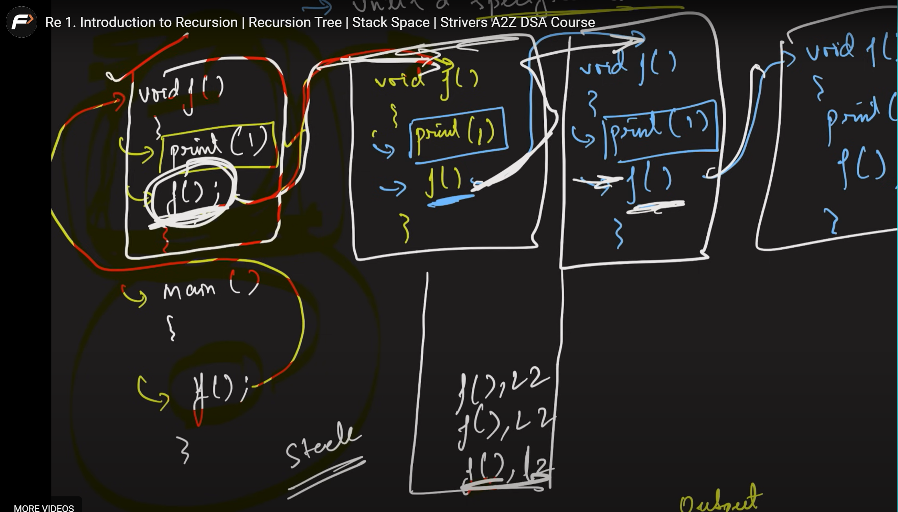
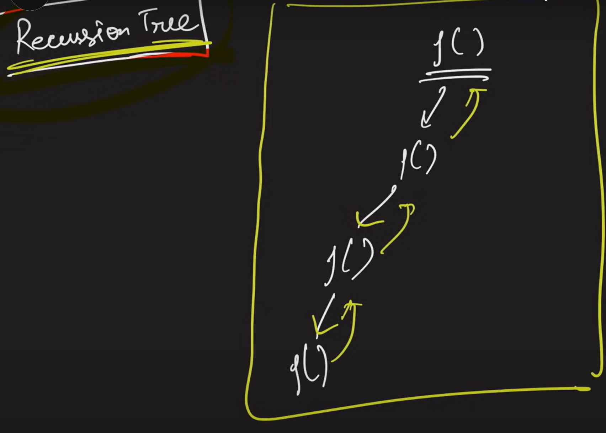

# Recursion

## Introduction to Recurion | Recursion Tree | Stack Space

### What is Recursion ?

- When a function calls itself until a specified condition is met

- Taken from Striver youtube video :-
  
- Wait time of function in stack in above case is known as stackoverflow bcuz stack has an limited merory that can't be keep on compiling that is when segmentation fault happen
- This is why we are not writing infinite recursion
- The conditon which we used to stop the recursive call is known as base case

### Recursion Tree

- 
- 
